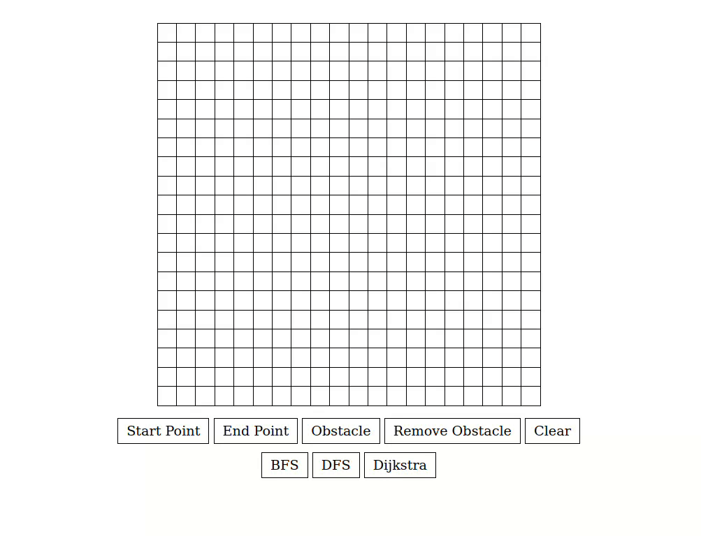

# Pathfinding Algorithm Visualizer

This Pathfinding Algorithm Visualizer is a web-based tool built using HTML5, CSS, and JavaScript. It allows users to visualize the workings of three popular pathfinding algorithms: Breadth-First Search (BFS), Depth-First Search (DFS), and Dijkstra's Algorithm. The visualizer is designed specifically for unweighted graphs.

## Table of Contents

- [Features](#features)
- [Usage](#usage)
- [Algorithms](#algorithms)
- [Demo](#demo)
- [Contributing](#contributing)

## Features

- Visualization of BFS, DFS, and Dijkstra's Algorithm on unweighted graphs.
- Interactive grid for defining start and target nodes, as well as obstacles.
- Step-by-step visualization to understand the process of each algorithm.
- Clear visualization of the path found by the algorithm.

## Usage

To use the Pathfinding Algorithm Visualizer, simply open the `index.html` file in a web browser that supports HTML5 and JavaScript. Once the application loads, follow these steps:

1. **Set Start Point**: Click the "Start Point" button.
2. **Define Start Node**: Click on a grid cell to set the starting point.
3. **Set End Point**: Click the "End Point" button.
4. **Define End Node**: Click on another grid cell to set the end point.
5. **Add Obstacles**: Click the "Obstacle" button, then move your mouse over cells to add obstacles. Double-click on a cell to stop adding obstacles.
6. **Remove Obstacles**: Click the "Remove Obstacle" button, then click on a cell to remove obstacles.
7. **Choose Algorithm**: Click one of the algorithm buttons to run it.
8. **View Results**: Watch as the algorithm finds the path.
9. **Clear or Refresh**: Clear the grid or refresh the page to try another algorithm.

## Algorithms

### Breadth-First Search (BFS)

BFS is a graph traversal algorithm that explores all the neighboring nodes at the present depth prior to moving on to the nodes at the next depth level. It guarantees the shortest path from the start node to all other nodes in an unweighted graph.

### Depth-First Search (DFS)

DFS is a graph traversal algorithm that explores as far as possible along each branch before backtracking. It may not find the shortest path, but it is often used in certain types of puzzles and games.

### Dijkstra's Algorithm

Dijkstra's Algorithm is a shortest-path algorithm that finds the shortest path between the start node and all other nodes in the graph. It works well for graphs with non-negative edge weights and is commonly used in routing and network optimization problems.

## Demo

For a live demo of the Pathfinding Algorithm Visualizer, visit https://abo-omar-74.github.io/Pathfinding-Algorithm-Visualizer/.

## Contributing

Contributions are welcome! If you have any ideas for improvements or new features, feel free to fork this repository, make your changes, and submit a pull request. Please adhere to the code formatting guidelines and include appropriate documentation for any new features.
